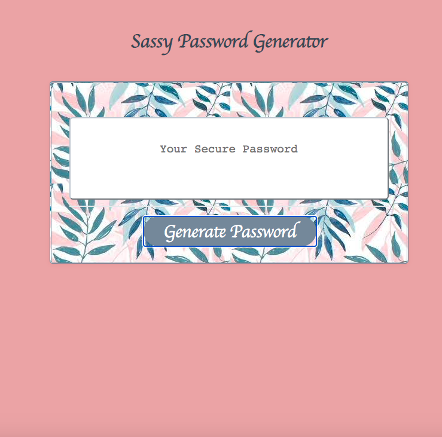

# sassy-password-generator

Sassy password generator is an application that enables a user to generate random passwords based on criteria selected by the user. The password can include upper case, lowercase, numbers, and special characters. 

# Criteria

* User must indicate password length of at least 8 characters and no more than 128 characters
* User must select at least one (lowercase, uppercase, numeric, and/or special characters) when generating password

# Webpage 

* Sassy Password Generator 

Application URL: https://fasicasr.github.io/sassy-password-generator/Develop/index.html
Github Repository: https://github.com/fasicasr/sassy-password-generator.git